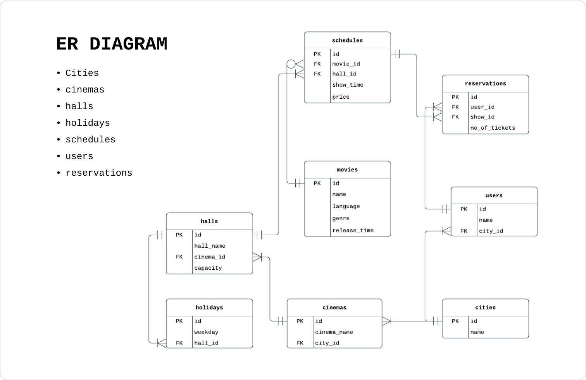

# MovieBookingSystem

    

## System
1. The system should be able to list down cities where its cinemas are located.
2. A cinema can have its own halls.
3. Each hall has its own schedule.
    - Each hall has two show per day, each show has a 4 hour slot and duration for all movies are considered to be less than 4 hours.
    - A hall can have holidays.
4. A user can book tickets for a schedule movie.
    - No need to consider the seating arrangements.
    - Each booking should be considered as purchase.
5. A user is a resident a city so there must be a relation to that user to the city.

## Queries
1. Write a query to find all distinct movies released per cinema.
2. Write a query to find the number of movies released this year per cinema.
3. Write a query to find those schedules for all halls which did not show any movies.

## Function
Write a scalar valued function which returns the weekend id for a hal.
- The is of days following: Sunday: 1, Monday: 2 etc.
- There should ve only one weekend.
- Input parameters for the function is hall id.

## Stored Procedure
Write a stored procedure to book ticket for a user
- Input parameters: User Id, Number of Tickets, Movie Schedule Id
- SP should output totat ticket price if successful.
- SP should retur -1 if hall capacity exceeds.
- SP should output -2 if anyone tries to book more than 4 tickets.